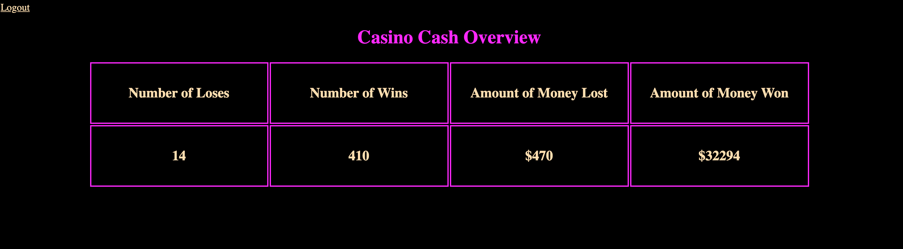

# :dollar: Super Simple Roulette Game

## Goal: Is to create an app that lets a user choose a number, color, and bet amount. The user is able to do this without logging in. If they win their money will double, if not they lose that bet amount. The owner is the only one able to login, that account is able to get an overview of the casino's winnings/losses. *styling: work in progress*


* **Image of home Page**


* **Image of Owner's Profile Page**


## How It's Made:

**Tech Used:** HTML5, CSS3, APIs, Javascript, Node.js, mongoDB, Express framework

## How It Works:

  * The index.html page has 3 inputs, and 2 dropdown menus.
  *  Once the user fills out all of their required fields and hits the "Feeling Lucky?" button, a randomizer + conditionals are used to determine if the user has won or lost.
  * The decision will show right on the main page. While automagically updating the owners database through 2 fetch request made to the server.
  * The database is keeping track of 4 things:
    * The number of times people have lost
    * The number of times people have won
    * The amount of money the casino has won for the day
    * The amount of money the casino has _lost_ for the day
  * The Owner has successfully logged in using the passport module, a chart with the information above is displayed. (login info)
  ```
  Email: Bossman@yahoo.com
  Password: 212121
  ```

  * There is also a "logout" link in the left corner that will redirect the owner back to the index.html page.

  ## Installation:

  1. Clone repo
  2. run `npm install`

  ## How To Use:

  1. run `node server.js`
  2. Navigate to `localhost:3000`
